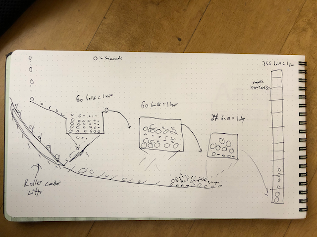

## Process

#### Inspiration

For this early concept, I'm trying to explore time as it relates to weight or mass. I was very inspired by the Roll-O-Clock which uses a system of balls, levers, and tracks to convey time without any (necessary) text. Additionally, a Rube Goldberg machine comes to mind when conveying time like this. Using simple machines to move an object or objects through a maze where one action sets off another can become visually interesting and complex very quickly.

Ideally, the final iteration of this representation of time won't need any additional explaination to be understood, regardless of the potentially chaotic feel of balls bouncing and speeding throughout.

#### Concept 1

This first concept is the simplest version of the ball contraption. Basically, objects representing seconds will conveyor belt into the window initially filling up the largest container. Once 60 balls fill the container, a trap door opens and all the balls fall out except one, which finds its way into the next container. This container represents minutes. Once this initial process happens 60 times, the next conainter gets the same treatment. Balls fall out except one which makes its way to the smaller box representing hours. As you can guess, once this process happens 24 times, a single ball survives and makes its way to a unique 1 x 365 container representing days in a year.

All of the balls that fall out the trap door of each container will land on a track below the suspended containers and make their way up a roller coaster style lift and ultimately be cycled through the process again.

##### Considerations

- Should all balls be the same size?
- Should they all move at the same speed?
- How to best convey the weight of all the balls is what "breaks" the floor of each container and what's special about the ball that suvives? Different color? Size?

I clearly have some things to still work about about this example but I think I'm on the right track.

---

### Final Result

- After exploring p5.js limitations in the canvas and discovering how hard it is to make instances of objects aware of each others' areas (i.e., not overlap), I decided to take the project in a different direction but still use the concept of volume/displacement.
- There are "rings" of balls falling from the sky cirlcing around for every time unit measurements (sec, min, hour, days of year) and once the rings are filled, they reset.
- In the small variation, there is no x movement so it's much more abstract. It also only tracks seconds, minutes, and hours.
- In the large variation, it's identical to the medium version except that there is an additional single ball representing years that never resets. This is our only measurement of time that approaches infinity while the rest of the units always reset.
