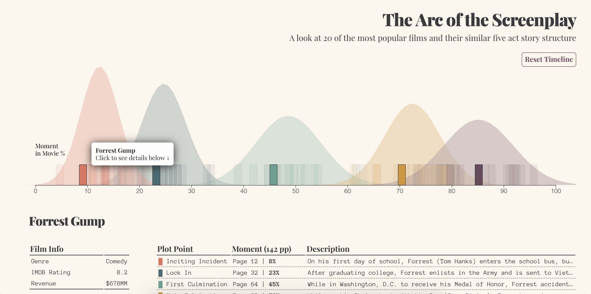

## Process

For early concept and variations, see the [initial proposal](https://github.com/samizdatco/dvia-2018/tree/master/4.final-project/students/am/andrew/process/initial-proposal) and [variations](https://github.com/samizdatco/dvia-2018/tree/master/4.final-project/students/am/andrew/process/variations) folders within my process documentation.

### Final Concept

- After analyzing the film data and trying to draw narrative contrast between the story structure and a characteristic of the movie like genre, budget, revenue, rating, etc., I determined that the more interesting story was how similar all these seemingly different movies were.

- Here I'm using bars along the x-axis (0 - 100%) to plot the moments in each of the 20 films which the plot points occur. Each movie has 5 bars, for each plot point and are distinguished by color.

- Additionally, in a lower opacity I'm plotting, on the same x-axis, the distribution/variance of the different moments these plot points occur in my sample of films and comparing that to the theory taught using bell curves.

#### Interaction

- Hovering over the bell curves describes the plot points and shows what the theoretical point of the movie it should occur as well as the average moment it occurs in these popular movies.

* Hovering over a bar with highlight all those movies plot points and fade out the others - this allows a user to see how the story unfolds across the timeline.

- Additionally, clicking on a bar will display information for that movie in a section of tables below, including genre, revenue, rating, and the 5 plot point moments and descriptions.

---

### Pushing this Further

- I want to build on this to include controls in the UI that allow you to filter the displayed films on the timeline by attributes like genre or rating in order to see how different types of films treat the 5 act structure.

- Also, since the plot point moments come from an educational film blog, I had to copy/paste all of the story data into Excel manually. It would be nice to attempt to collaborate with the owner of the blog, as I'm visualizing his written work, as well as set up an ability (maybe a google doc) so others can help maintain it. The more films the more accurate this is as a tool and a model.
