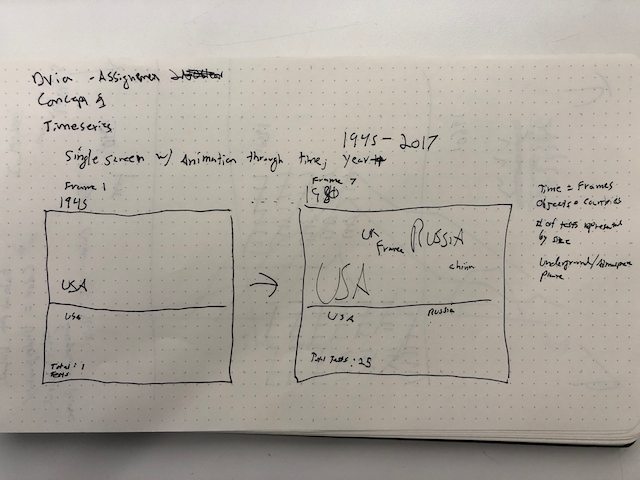
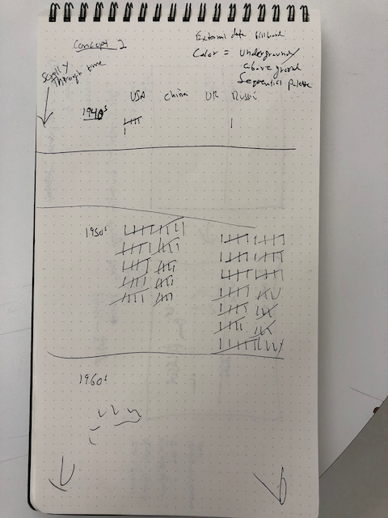
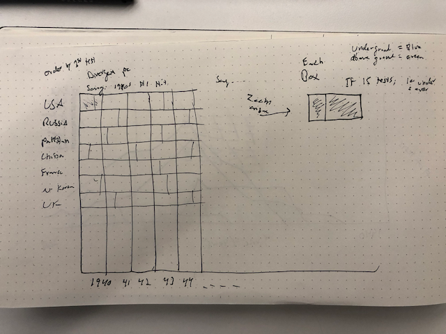

## Process

Description of the contents of this folder, a prose description of your ideas for how to represent
the nuclear testing time series, and links to external data sources you'll be incorporating into
the project.

### Ideation

#### Sketch Concept 1

- Concept 1 expresses time as a series of single frames. Every second a new year takes over the entire canvas.
- The objects are the text of the country, positioned roughly where they appear on a world map.
- The size of the text indicates the number of tests that year
- Above/underground: Either above or below line (see drawing) or divergent palette which colors the text.
- External data set: play top billboard song during each decade (10 seconds)

#### Sketch Concept 2

- Concept 2 uses tally marks for the number of tests per decade
- Vertical scroll, time on the y axis
- Colors of tally marks will be either blue or red indicating an underground or above ground text

#### Sketch Concept 3

- Heat map style plot
- Time on x axis
- Each country box is split between above and below ground test.

#### Secondary data set

Billboard top songs of each decade

- [Billboard wiki](https://en.wikipedia.org/wiki/List_of_Billboard_Hot_100_chart_achievements_by_decade)

- +additional compiled asset folders for audio files and texture images

---

### Final Concept Variations

- There are three categories of data separated by sections:

  1. USA
  2. Russia
  3. Sum of all other countries combined

* A qualitative/categorical color palette is used to represents the decade these tests were conducted.

##### Final Concept #1

- Within each country, every nuclear test is represented by a 20px x 20px block (so each test has the same visual weight) stacked in a grid.

##### Final Concept Part Two

- Instead of the absolute number of tests displayed, each country is "normalized" like a stacked bar chart with 100 blocks. The percentage of tests done in that decade for that country is displayed.

#### Cultural component

- There are 2 elements of culture integrated into the nuclear testing data:
  1. The color of the blocks use the textures and patterns of the "vibe" of that decade.
  2. Songs of the decade are displayed and played through automatically

#### Presentation Medium

- The thought here, is that this would be displayed as long, digital poster. Lights would turn on and off to 'activate' the decades every 30 seconds and cycle through the songs and news of the corresponding time period.
  - An 'activated' decade highlights the corresponding tiles, sounds, and patterns
  - Additionally, an interactive installed piece, one could also press the decade tiles in the legend to activate decades manually.

#### Pushing this Further

- Sequential color: I could experiment with a sequential color palette for the background color. The intensity would correspond to the absolute number of tests during that decade
- Audio traits: I could take advantage of the unique traits of audio like volume and length to encode more data.
  - In my 3rd variation I tested volume levels to correspond to the number of tests for that decade. In a web-based presentation, it doesn't read very well but in an installed piece where the audience has no control, it could definitely add to the emotional impact of the narrative.
