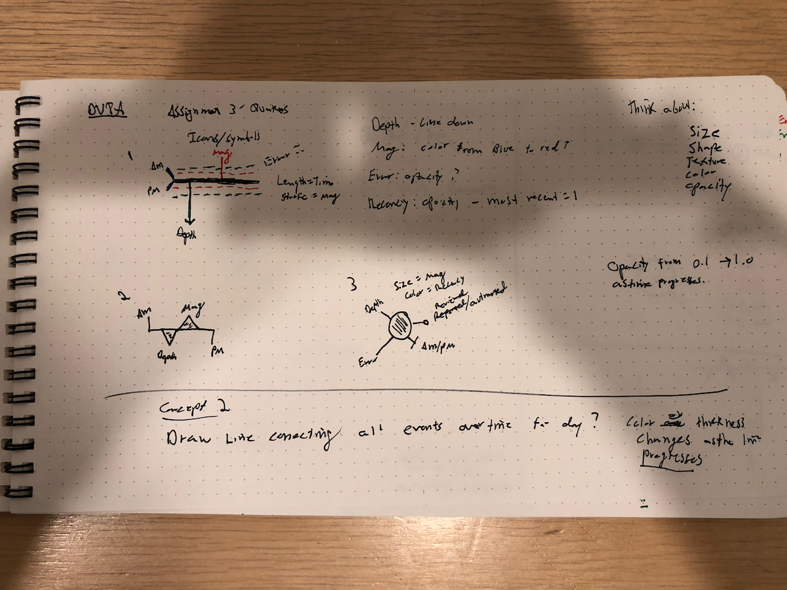
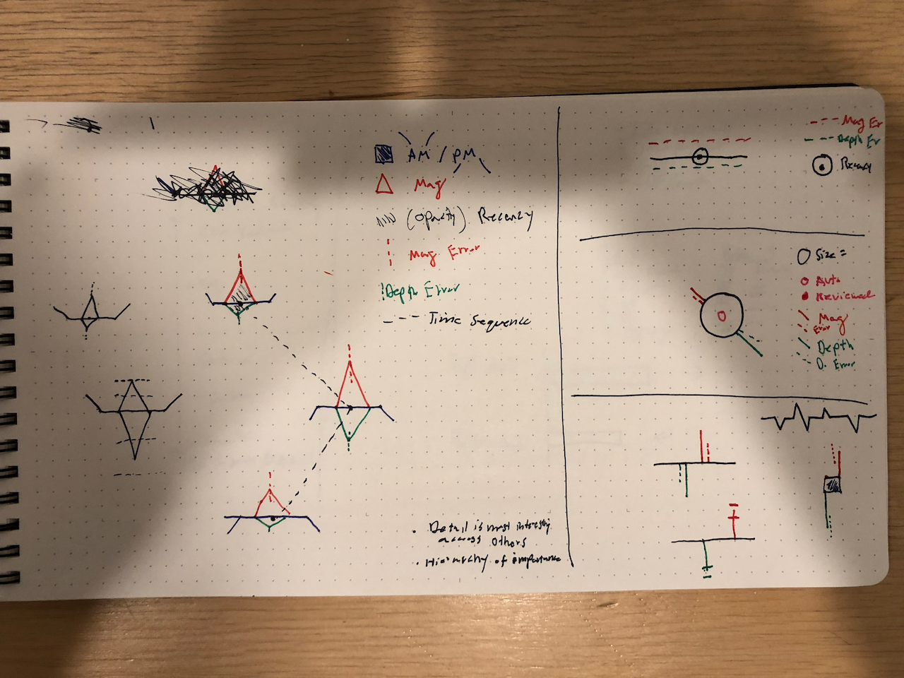

## Process

Description of the contents of this folder and a prose description of your ideas for how to represent
the earthquake data geospatially and diagrammatically.

---

### Ideation

#### Early Concepts

#### Revised Concepts...a little tighter

- Using the Giorgia Lupi style approach, I worked on creating a symbol for each marker packed with data points for mag, mag error, depth, time, etc where color, position, and angle communicate different pieces of data for each event in the CSV.

#### Data Points Used

6 Data Points to be incorporated into each symbol

- Magnitude, Magnitude Error, Depth, Depth Error, Horizontal Error, Time

---

### Final Concept

- Plotting significant events over the last month, where there are 13 since the marker symbols are quite detailed and benefit from as much space as possible.

- These symbols are plotted on the map and are connected by a dotted line to visualize the order in which they occurred.

- Additionally, a summary paragraph and "current earthquake" paragraph are dynamically generated, providing additional details

##### Interaction

- Can step through the earthquakes using previous/next buttons on fixed right panel

* When an earthquake is in focus, it zooms into that point on the map, the data paragraph tells information about location, mag, and depth and uses arrows to indicate whether the data points were above/below that of an avg. earthquake in the current set.

---
